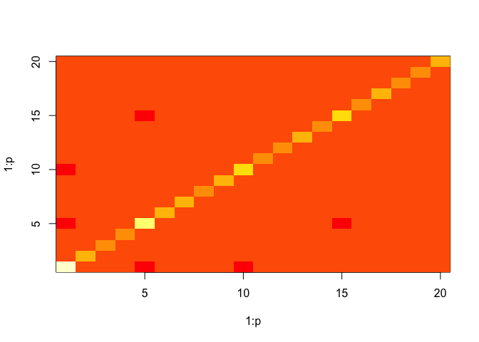

# CSAD: Contrastive Structured Anomaly Detection for Gaussian Graphical Models


```r
set.seed(314)
p <- 20
N_back <- 500
N_fore <- 50

X_back <- matrix(rnorm(N_back * p), nrow = N_back, ncol = p)
X_fore <- matrix(rnorm(N_fore * p), nrow = N_fore, ncol = p)

X_back[, 5] <- X_back[, 1] + rnorm(N_back, 0, 0.75)
X_fore[, 5] <- X_fore[, 1] + rnorm(N_fore, 0, 0.75)
X_back[, 10] <- X_back[, 1] + rnorm(N_back, 0, 0.75)
X_fore[, 10] <- X_fore[, 1] + rnorm(N_fore, 0, 0.75)
X_back[, 15] <- X_back[, 5] + rnorm(N_back, 0, 0.75)
X_fore[, 15] <- X_fore[, 5] + rnorm(N_fore, 0, 0.75)
X_fore[, 19] <- X_fore[, 1] + rnorm(N_fore, 0, 0.75)
X_fore[, 20] <- X_fore[, 5] + rnorm(N_fore, 0, 0.75)
```


```r
library(CSAD)
csad <- csad(X_back, X_fore, quiet = TRUE)
#> 
#>  Best Parameters Found: 
#> Round = 7	lambda = 0.0516	rho = 0.0885	Value = -4028.4560
image(1:p, 1:p, csad$back)
```

<!-- -->

```r
image(1:p, 1:p, abs(csad$fore) > 0.1)
```

<!-- -->


```r
bsad <- bsad(X_back, X_fore)
image(1:p, 1:p, abs(bsad$fore) > 0.1)
```

<!-- -->


```r
plot(csad$admm)
```

<!-- -->

## References

Abhinav Maurya & Mark Cheung, "Contrastive Structured Anomaly Detection for Gaussian Graphical Models", 2016

