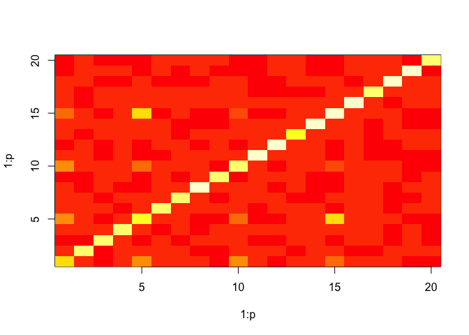
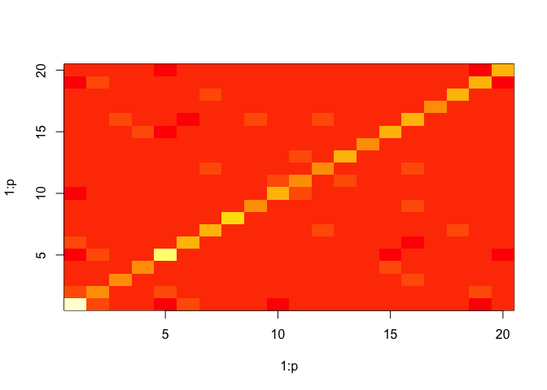

# CSAD: Contrastive Structured Anomaly Detection for Gaussian Graphical Models


```r
set.seed(314)

library(mvtnorm)
p <- 20
N_back <- 400
N_fore <- 40

Mu <- rep(0, p)
Sigma <- matrix(0, nrow = p, ncol = p)
diag(Sigma) <- 1
Sigma[5, 10] <- Sigma[10, 5] <- 0.7
Sigma[5, 15] <- Sigma[15, 5] <- 0.4
X_back <- as.data.frame(rmvnorm(N_back, Mu, Sigma))

Sigma[15, 20] <- Sigma[20, 15] <- 0.8
X_fore <- as.data.frame(rmvnorm(N_fore, Mu, Sigma))
```


```r
library(CSAD)
csad <- csad(X_back, X_fore, .3, .1)
image(1:p, 1:p, csad$back)
```

<!-- -->

```r
image(1:p, 1:p, csad$fore)
```

<!-- -->


```r
bsad <- bsad(X_back, X_fore)
image(1:p, 1:p, bsad$fore)
```

<!-- -->


```r
plot(csad$admm)
```

<!-- -->

## References

Abhinav Maurya & Mark Cheung, "Contrastive Structured Anomaly Detection for Gaussian Graphical Models", 2016

